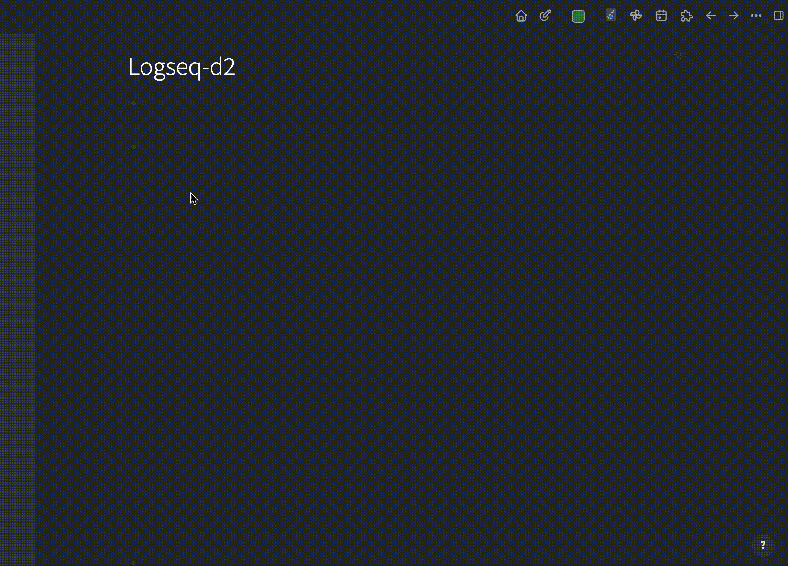

## Logseq d2 plugin

### Demo

### Usage

- Use the slash command `/d2` to generate a d2 code block, enter the d2 code, and click other places with the mouse
- Enter the second and third parameters in the `renderer` to set the width and height, such as the width of 100px and the height of 200px
    - `{{renderer :d2_lang_gkkbq, 100, 200}}`

> See [d2](https://d2lang.com/) for more syntax

### Thanks

- Thank you for your interface @[YashBhalodi](https://github.com/YashBhalodi)
